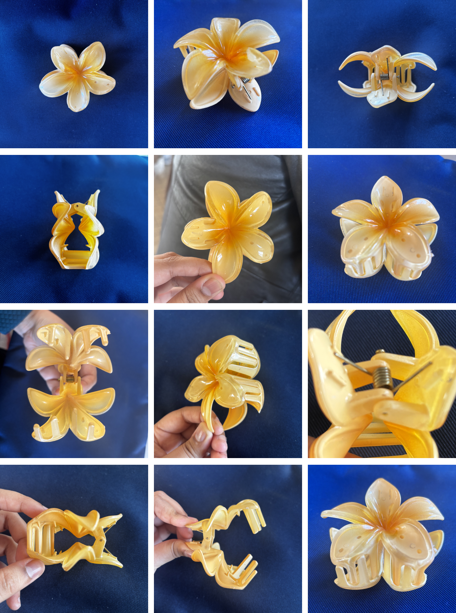
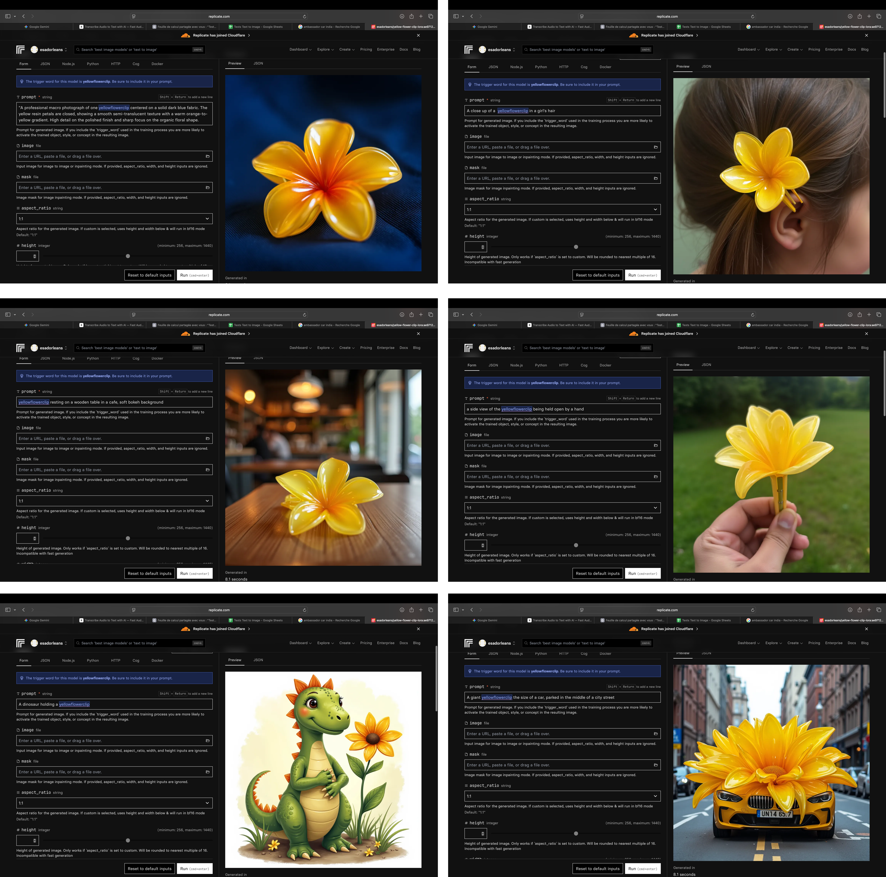

# Exercise 2: Subject Training (LoRA)

## Objective

The goal of this exercise was to train a LoRA model on a specific object in order to understand how AI learns form, volume, and visual consistency.

Unlike prompt-based generation, this process involves teaching the model through a curated dataset.

---

## Chosen Subject

The object selected for this exercise was a **yellow flower clip**.

This object was chosen because it has:
- a recognizable shape  
- distinct color and material properties  
- small scale physical detail  

---

## Dataset Curation

A dataset of approximately 15 images was created following a controlled approach:

- Multiple angles (front, side, top, in use)  
- Close up and mid range shots  
- Consistent lighting conditions  
- Neutral backgrounds to isolate the object  

### Trigger Word  
`yellowflowerclip`

This keyword was used during training to associate the object with the model.

---

## Training Process

The dataset was used to train a LoRA model, allowing the base model to learn:

- The geometry of the clip  
- Its color and texture  
- Its structural details  

Each image was paired with a text annotation describing:
- the object  
- its position  
- its relationship to the environment
- 

---

## Challenges

### Scale Problem

The model initially struggled to understand the size of the object.

Because many images were close ups, the AI sometimes generated:
- oversized clips  
- unrealistic proportions 

---

## Results

The trained LoRA was able to generate:

- recognizable versions of the flower clip  
- consistent color and structure  
- variations in angle and context  

However, some distortions remained in:
- scale  
- fine structural accuracy

---

## Key Learnings

This exercise demonstrated that:

- A LoRA model is highly dependent on **dataset quality**  
- The model learns from **annotations, not intention**  
- Scale and context must be explicitly taught  
- Small objects are harder to learn due to lack of spatial reference  

Most importantly:

> Training a model is less about quantity of images and more about the precision of data and labeling.
