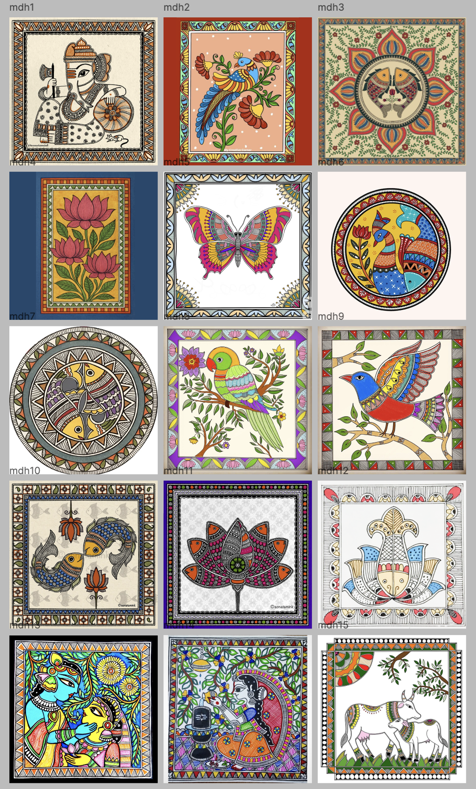
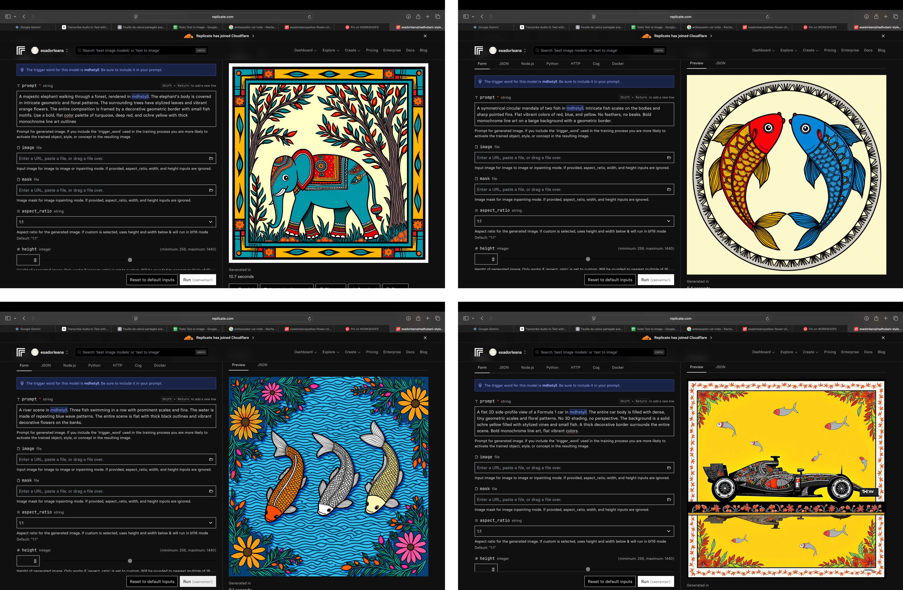

# Exercise 3: Style Training (Madhubani)

## Objective

The goal of this exercise was to train a LoRA model on a specific artistic style in order to understand how AI learns visual patterns, structure, and stylistic rules.

Unlike subject based training, this task focused on capturing a **visual system** rather than a single object.

---

## Chosen Style

The selected style for this exercise was **Madhubani art**, a traditional Indian folk art characterized by:

- bold outlines  
- flat, saturated colors  
- repetitive geometric and floral patterns  
- highly decorative borders  
- dense compositions with minimal empty space  

---

## Dataset Curation

A dataset of 15 images was curated, focusing on consistency rather than diversity.

The dataset emphasizes:
- symmetrical compositions  
- strong line-based structures  
- repetitive motifs (flowers, birds, animals)  
- characteristic border designs  

### Trigger Word  
`mdhstyll`

This keyword was used to activate the learned style during generation.

---

## Training Process

The LoRA model was trained to capture:

- line quality and thickness  
- pattern repetition and rhythm  
- color relationships  
- compositional framing (especially borders and central subjects)  

Each image was paired with annotations describing stylistic elements such as:
- geometric fill patterns  
- decorative density  
- traditional line work  

---

## Observations

### Style Learning vs Object Learning

Unlike objects, style is not a fixed form but a set of visual rules.

The model showed that:
- color and composition are learned relatively quickly  
- fine line quality and pattern precision are harder to reproduce  

---

## Generated Outputs

The trained LoRA was used to apply Madhubani style to different subjects.

The outputs demonstrate:

- successful transfer of decorative borders and framing  
- consistent use of flat colors and bold outlines  
- ability to apply the style to new subjects (animals, objects, vehicles)  

Notably, the model was able to stylize:
- traditional subjects (fish, animals)  
- non-traditional subjects (e.g. a Formula 1 car)  

---

## Limitations

- line sharpness is sometimes inconsistent  
- patterns can lose precision in complex areas  
- some outputs simplify the original density of the style  

---

## Key Learnings

This exercise showed that:

- Style is learned through **repetition and consistency**, not variation  
- The model captures style as a **set of visual patterns**, not cultural meaning  
- Borders and composition are strong anchors for stylistic identity  
- Applying style to unexpected subjects reveals the flexibility of generative models  

Most importantly:

> Training a style is about encoding a system of visual rules rather than reproducing specific images.
