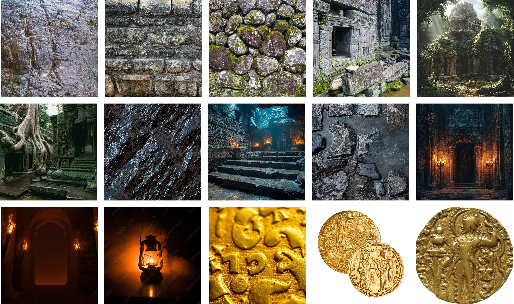
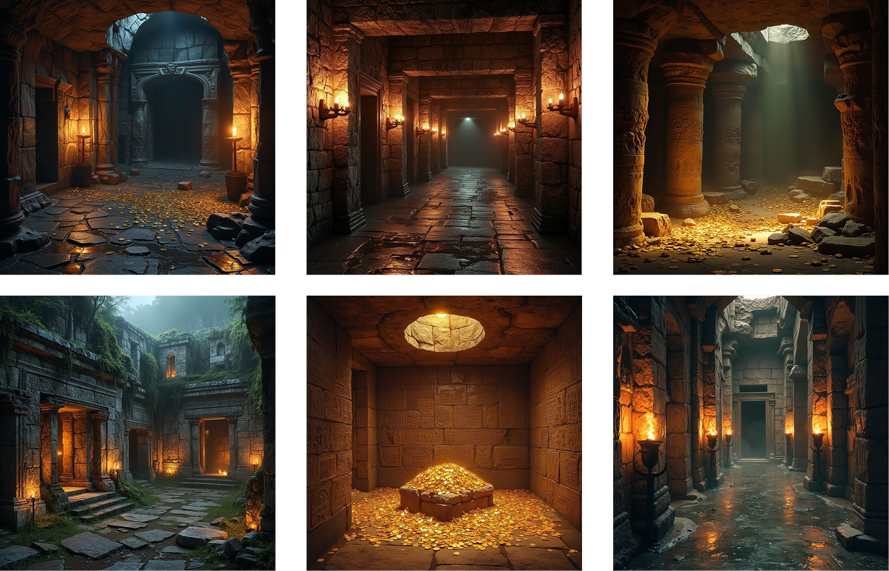
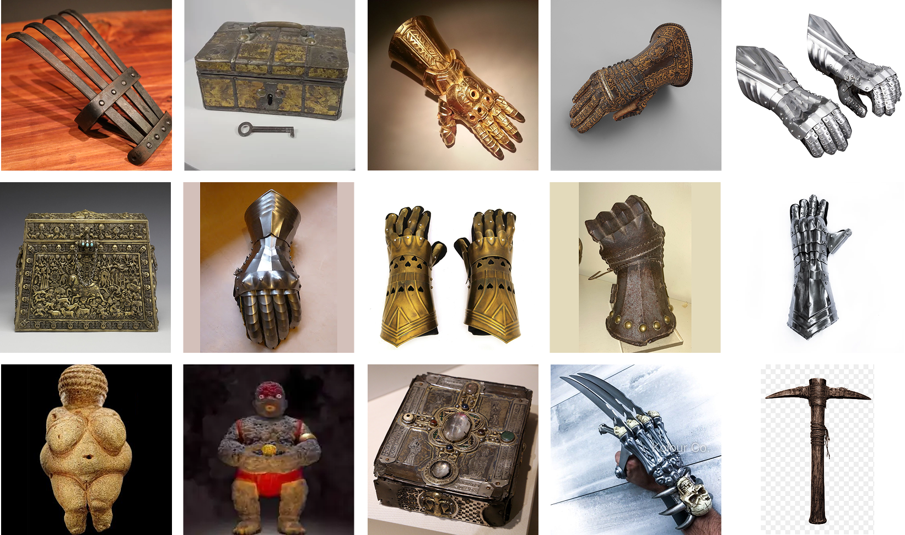
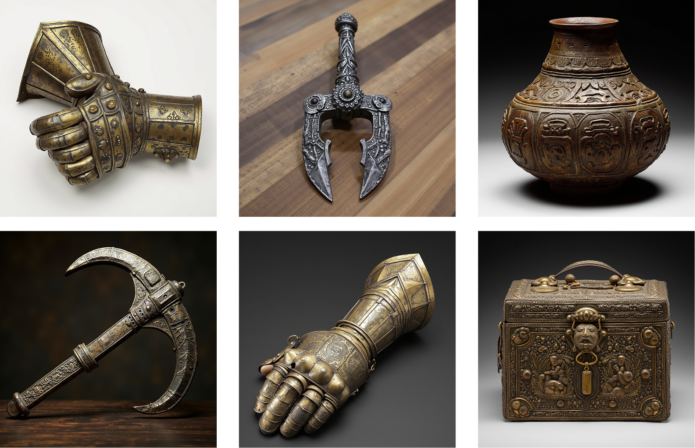
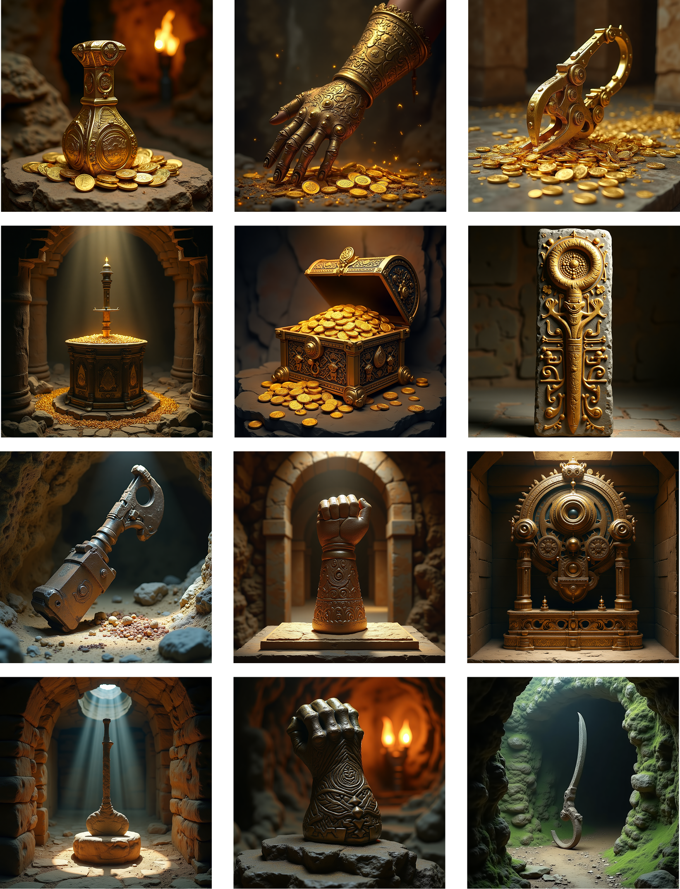

# Final Project: Speculative Worldbuilding with AI (Tumbbad)

## Introduction

This project extends the workshop into a speculative design investigation, treating AI not as a tool for image generation, but as a **system capable of learning and reproducing a coherent world**.

Rather than producing isolated outputs, the objective was to construct a **unified fictional universe** and generate artifacts that feel intrinsically embedded within it.

The project is inspired by the film *Tumbbad*, whose visual and narrative richness provides a strong foundation for exploring the relationship between **environment, material, and object design**.

---

## Why Tumbbad

*Tumbbad* presents a universe that is both visually and conceptually dense.

It is defined by:

- enclosed underground architectures  
- влаж, decaying materials (mud, stone, oxidized surfaces)  
- a constant interplay between darkness and warm, flickering light  
- the overwhelming presence of gold as both material and symbol  

The world is governed by a narrative of **greed, repetition, and risk**, where characters repeatedly enter a hidden space to extract gold from a mysterious entity.

This makes it particularly relevant for this project, as it provides:

- a strong **material logic** (gold, stone, moisture)  
- a clear **environmental constraint system**  
- a narrative context that implies the need for specific tools and objects  

---

## The Universe (Sensory and Material Logic)

The Tumbbad universe is not only defined by its visuals, but by its **atmospheric and sensory qualities**.

It is a space of:

- low visibility, with localized warm light sources  
- влаж, heavy surfaces that suggest age and decay  
- confined spatial structures that create a sense of pressure and repetition  

Gold, in this context, is not ornamental. It appears excessive, dense, and almost organic, reinforcing the tension between desire and danger.

This sensory understanding guided the dataset construction, ensuring that the model learns not just visual elements, but a **coherent environmental logic**.

---

## Design Intent

The central question driving this project is:

**How can AI generate objects that belong to a specific fictional world?**

Instead of designing objects directly, the approach was to construct a **two-layer generative system**:

1. A model that learns the **environment (world logic)**  
2. A model that learns the **objects (artifact logic)**  
3. A combination of both to produce **context-aware generations**

This approach aligns with the concept of **double LoRA**, where two distinct learning processes are combined at generation time.

---

## Part 1: Training the Universe (Environment LoRA)

### Dataset Construction

The first LoRA was trained on images representing the Tumbbad universe:

- underground caves and temple-like structures  
- eroded stone surfaces and влаж textures  
- dim lighting with strong warm highlights  
- gold coins and reflective surfaces  
- enclosed, repetitive architectural spaces  

Each image was selected to reinforce a consistent **material and atmospheric language**.

---

### Generated Results

The trained model produced:

- atmospheric underground interiors  
- spatially coherent cave environments  
- compositions centered around gold and light contrast  

---

### Analysis

The environment LoRA successfully captured:

- **lighting conditions** (low light with warm focal points)  
- **material consistency** (stone, gold, влаж surfaces)  
- **spatial atmosphere** (enclosed, immersive environments)  

This model establishes the **contextual framework** within which objects can exist.

---

## Part 2: Training the Artifacts (Object LoRA)

### Dataset Construction

A second LoRA was trained on objects that could plausibly exist in such a world:

- protective gloves and gauntlets  
- containers, chests, and storage objects  
- tools and mechanical forms  
- worn metallic surfaces and ornamental detailing  

The dataset emphasizes:

- functionality  
- material wear  
- structural clarity  

---

### Generated Results

The model generated:

- structured and recognizable objects  
- consistent metallic textures  
- variations in form and ornamentation  

---

### Analysis

The artifact LoRA demonstrated:

- strong understanding of **object typologies**  
- consistent reproduction of **material properties**  
- partial success in conveying **functional logic**  

However, without environmental context, objects remain visually isolated.

---

## Part 3: Combining World and Objects (Double LoRA)

The final stage consisted of combining both LoRAs during generation.

---

### Example: Gold Gauntlet

A key generated artifact is the **gold gauntlet**:

- functions as a protective interface for collecting coins  
- reflects the material logic of the environment  
- integrates ornamentation with utility  

This object emerges not as an isolated design, but as a **direct response to environmental constraints**.

---

## Generated Object System

The combined model produced a range of artifacts:

- storage containers for gold  
- extraction tools  
- ritual-like structures  
- hybrid objects combining utility and symbolism  

These objects appear as part of a **coherent design ecosystem**, shaped by:

- environmental pressure  
- material constraints  
- narrative context  

---

## Critical Analysis

The results reveal a strong coherence between environment and objects:

- consistent material palette (gold, stone, decay)  
- unified lighting conditions  
- spatial integration of objects within the environment  

However, several limitations remain:

- certain objects lack clear functional realism  
- over-reliance on gold as a dominant visual feature  
- occasional simplification of complex structures  

These gaps highlight the importance of:

- more diverse datasets  
- more precise annotation strategies  
- iterative refinement cycles  

---

## Iteration Note

Due to time constraints, this project focuses on a first complete training cycle rather than multiple iterations.

However, the observed limitations provide clear directions for future refinement, particularly in improving dataset variation and annotation precision.

---

## Reflection

This project demonstrates a shift in the role of the designer.

Rather than directly creating objects, the designer becomes:

- a **curator of datasets**  
- a **constructor of visual rules**  
- an **orchestrator of generative systems**  

AI does not imagine independently; it recombines learned patterns.  
The design process therefore shifts toward defining the **conditions under which meaningful outputs can emerge**.

---

## Conclusion

By structuring the project into two learning layers—environment and object—it becomes possible to generate artifacts that feel embedded within a fictional world.

This approach positions AI as a tool for:

- speculative design  
- narrative-driven object creation  
- world-based generative systems  

It opens new possibilities for designing not only objects, but the **systems and contexts from which they arise**.

---

## Model Access

To support reproducibility and transparency, the trained LoRA models are available below:

- **Tumbbad Universe LoRA (Environment Model):**  
https://replicate.com/esadorleans/tumbbad-gold-world  

- **Tumbbad Artifacts LoRA (Object Model):**  
https://replicate.com/esadorleans/tumbbad-artifacts-lora  
